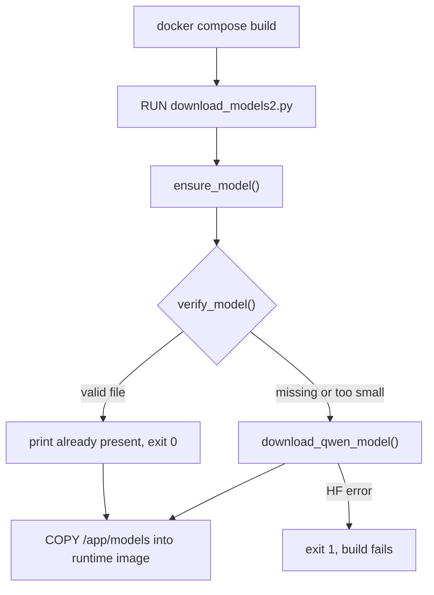

# Auto Model Check on Every Build

## Goal

Replace the manual `DOWNLOAD_BGE=0/1` switch with an always-on **check-then-download-if-missing** flow at image build time. No `.env` flag required.



## 1. Remove `DOWNLOAD_BGE` from env files

- [`.env`](.env) — delete `DOWNLOAD_BGE=0` line (keep `LOG_LEVEL=INFO`)
- [`.env.example`](.env.example) — delete `DOWNLOAD_BGE=0` line

## 2. Update [`backend/download_models2.py`](backend/download_models2.py)

`ensure_model()` already exists (lines 17–23) and is used by [`backend/app/workers/worker.py`](backend/app/workers/worker.py). Refactor `main()` to use it instead of the `DOWNLOAD_BGE` gate:

**Remove:**
- `DOWNLOAD_BGE` constant (line 14)
- `if not DOWNLOAD_BGE: ... return` branch (lines 55–57)
- `DOWNLOAD_BGE=1` success message

**Replace `main()` with:**

```python
def main() -> None:
    MODEL_PATH.mkdir(parents=True, exist_ok=True)
    dest = expected_model_path()
    try:
        verify_model(dest)
        print(f"Model already present at {dest}")
        return
    except (FileNotFoundError, ValueError):
        pass
    try:
        dest = download_qwen_model(MODEL_PATH)
    except Exception as exc:
        print(f"Model download failed: {exc}", file=sys.stderr)
        sys.exit(1)
    print(f"Downloaded model to {dest}")
```

Update module docstring to: *"Build-time model downloader — ensures Qwen GGUF is present; downloads if missing."*

No changes needed to `qwen35-4B-super-coder.py` (still abort-only at runtime).

## 3. Update [`docker/Dockerfile.backend`](docker/Dockerfile.backend)

In the `model-downloader` stage:

**Remove:**
```dockerfile
ARG DOWNLOAD_BGE=0
```

**Change RUN** (line 39–40) from:
```dockerfile
DOWNLOAD_BGE=${DOWNLOAD_BGE} MODEL_PATH=/app/models python /app/download_models2.py
```
to:
```dockerfile
MODEL_PATH=/app/models python /app/download_models2.py
```

Keep the existing HuggingFace cache mount (`--mount=type=cache,target=/root/.cache/huggingface`) so re-downloads are faster when Docker invalidates the RUN layer.

## 4. Update [`docker/docker-compose.yml`](docker/docker-compose.yml)

Remove the `DOWNLOAD_BGE` build arg from `api-worker` (lines 115–116):

```yaml
# remove this block entirely:
      args:
        DOWNLOAD_BGE: ${DOWNLOAD_BGE:-0}
```

`backend` and `api-worker` will both build with the same automatic model-check behavior.

## Build behavior after change

| Scenario | Result |
|----------|--------|
| First build | Downloads ~2.5 GB GGUF, bakes into image at `/app/models` |
| Rebuild, Docker layer cache hit | Entire `RUN download_models2.py` skipped (fast) |
| Rebuild, layer cache miss (e.g. script changed) | `ensure_model()` runs; file missing in fresh stage → re-downloads |
| HF unreachable during build | `sys.exit(1)` → build fails loudly |

**Note:** Models are baked into the image, not on a runtime volume. api-worker also calls `ensure_model()` at startup ([`worker.py`](backend/app/workers/worker.py) line 9) as a safety net if the image was built without the model.

## Out of scope

- Adding a `model_data` Docker volume (runtime persistence across container recreates)
- Deduplicating `backend` / `api-worker` into a single shared `image:` tag
- Editing plan files under `.cursor/plans/`
