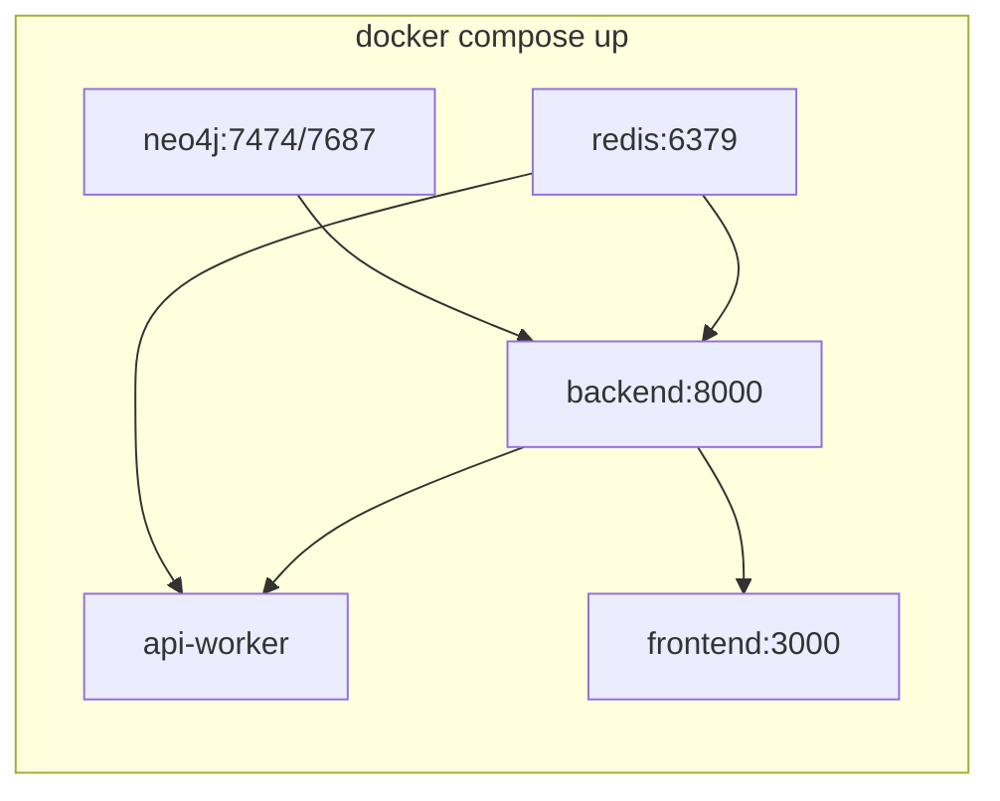

# Docker Baseline Stubs Plan

## Current state

The repo has Docker orchestration in place but almost no application code:

| Layer | Exists | Blocks build/up |
|-------|--------|-----------------|
| [docker/docker-compose.yml](docker/docker-compose.yml) | Full stack (neo4j, redis, backend, api-worker, frontend) | — |
| [docker/Dockerfile.backend](docker/Dockerfile.backend) | Multi-stage CUDA image | Missing `COPY download_models2.py`; no script file |
| [docker/Dockerfile.frontend](docker/Dockerfile.frontend) | Multi-stage Next.js standalone | No `package.json`, `next.config.ts`, or `src/` |
| [backend/app/requirements.txt](backend/app/requirements.txt) | Full ML deps | Wrong path — Dockerfile expects `backend/requirements.txt` |
| App code | Missing | No `app/main.py` (`/health`), no worker module |



## What we will create

### 1. Baseline environment file

Create [`.env.example`](.env.example) at project root with the compose-interpolated variables and documented defaults:

```dotenv
LOG_LEVEL=INFO
DOWNLOAD_BGE=0
```

Update [`.gitignore`](.gitignore) to add `!.env.example` (currently `.env*` blocks it from being committed, while [`.dockerignore`](.dockerignore) already whitelists it for frontend builds).

### 2. Backend minimal stubs

**Path fix:** Add [`backend/requirements.txt`](backend/requirements.txt) — slim stub set (no torch/transformers yet) sufficient for `/health` + RQ worker:

- `fastapi`, `uvicorn[standard]`, `redis`, `rq`, `neo4j`, `pydantic`, `pydantic-settings`

Keep [`backend/app/requirements.txt`](backend/app/requirements.txt) as-is or add a one-line pointer comment; the Dockerfile only reads the root file.

**Model downloader (no-op):** Add [`backend/download_models2.py`](backend/download_models2.py) — when `DOWNLOAD_BGE=0` (default), create `/app/models` and exit; skip HuggingFace downloads.

**FastAPI app:** Add minimal package:

- [`backend/app/__init__.py`](backend/app/__init__.py)
- [`backend/app/main.py`](backend/app/main.py) — `GET /health` returns `{"status":"ok"}` (satisfies compose + Dockerfile healthchecks)

**RQ worker:** Add [`backend/app/workers/worker.py`](backend/app/workers/worker.py) — connect to `REDIS_URL`, run `rq.Worker` on `RQ_QUEUE_NAME` (matches api-worker `command` in compose).

**One-time scripts (stubs):** Add no-op/safe versions referenced in compose comments:

- [`backend/scripts/download_models.py`](backend/scripts/download_models.py)
- [`backend/scripts/init_neo4j.py`](backend/scripts/init_neo4j.py) — connect to Neo4j via env vars, run `RETURN 1` to verify connectivity

**Docker context hygiene:** Add [`backend/.dockerignore`](backend/.dockerignore) — exclude `__pycache__`, `.venv`, local `models/`, tests.

### 3. Backend Dockerfile fix

In [`docker/Dockerfile.backend`](docker/Dockerfile.backend) model-downloader stage, add **before** the `RUN ... download_models2.py` line:

```dockerfile
COPY download_models2.py /app/download_models2.py
```

Without this, the build fails even after the script exists.

### 4. Frontend minimal stubs

Create the smallest Next.js 16 standalone app the existing [`docker/Dockerfile.frontend`](docker/Dockerfile.frontend) expects:

| File | Purpose |
|------|---------|
| [`package.json`](package.json) | `next@^16`, `react@^19`, `build`/`dev` scripts; name `rag-lab-v1` to match lockfile workspace |
| [`next.config.ts`](next.config.ts) | `output: "standalone"` (required by Dockerfile `grep` check) |
| [`tsconfig.json`](tsconfig.json) | Minimal Next.js TS config |
| [`src/app/layout.tsx`](src/app/layout.tsx) | Root layout |
| [`src/app/page.tsx`](src/app/page.tsx) | Simple landing page ("RAG Lab baseline") |
| [`public/.gitkeep`](public/.gitkeep) | Satisfy `COPY public` in Dockerfile |

**Lockfile:** Regenerate [`bun.lock`](bun.lock) with `bun install` after adding the minimal `package.json` so `bun install --frozen-lockfile` in the Docker build succeeds. The current lockfile references the full UI dependency tree but `package.json` is missing.

No API proxy routes needed for baseline — frontend only needs to build and serve `server.js` on port 3000.

### 5. No compose/GPU changes

Per your choice, keep GPU reservations in [docker/docker-compose.yml](docker/docker-compose.yml) unchanged. Baseline verification assumes NVIDIA Container Toolkit is installed.

## Verification steps (after implementation)

From project root:

```powershell
copy .env.example .env
docker compose build
docker compose up -d
docker compose ps
curl http://localhost:8000/health
curl http://localhost:3000
```

Optional post-up init (stubs should not fail):

```powershell
docker compose run --rm backend python scripts/init_neo4j.py
```

## Risk notes

- **First backend build is slow** — CUDA base image + pip install; expected.
- **Torch/ML deps deferred** — stub `requirements.txt` omits heavy packages; swap in full deps from `backend/app/requirements.txt` when implementing RAG features.
- **Windows host** — GPU passthrough requires WSL2 + NVIDIA setup; without it, `docker compose up` may fail on GPU reservation even if images build.
