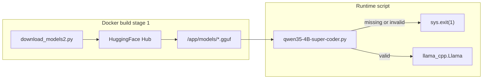

# Qwen3.5-4B Super Coder Model Download Plan

## Current state

| File | Issue |
|------|-------|
| [`backend/download_models2.py`](backend/download_models2.py) | Stub only — prints "not implemented" when `DOWNLOAD_BGE=1` |
| [`backend/scripts/qwen35-4B-super-coder.py`](backend/scripts/qwen35-4B-super-coder.py) | Calls `hf_hub_download` at runtime (no validation, no abort) |
| [`docker/Dockerfile.backend`](docker/Dockerfile.backend) | Model-downloader `RUN` is commented out; `download_models2.py` is never copied into stage 1 |



## 1. Rewrite [`backend/download_models2.py`](backend/download_models2.py)

Add shared constants and helpers used by both the downloader and the Qwen script:

```python
REPO_ID = "jica98/qwen3.5-4B-super-coder"
FILENAME = "qwen3.5-4B-super-coder.Q4_0.gguf"
MIN_SIZE_BYTES = 2_000_000_000  # sanity check for Q4_0 ~2.5 GB
```

**Functions to add:**

- `expected_model_path(model_dir: Path | None = None) -> Path` — returns `MODEL_PATH / FILENAME` (reads `MODEL_PATH` env, default `/app/models`)
- `verify_model(path: Path) -> None` — raises `FileNotFoundError` if missing, `ValueError` if file is empty or below `MIN_SIZE_BYTES`
- `download_qwen_model(model_dir: Path) -> Path` — uses `huggingface_hub.hf_hub_download` with `local_dir=str(model_dir)` and `local_dir_use_symlinks=False`, then calls `verify_model` on the result

**`main()` behavior (unchanged gate, new implementation):**

- Always `mkdir` `MODEL_PATH`
- `DOWNLOAD_BGE=0` (default): skip download, print skip message, exit 0
- `DOWNLOAD_BGE=1`: call `download_qwen_model`, print success path, exit 0
- On any download/verification failure: print error to stderr, `sys.exit(1)`

Keep the existing `DOWNLOAD_BGE` env var so [`docker/docker-compose.yml`](docker/docker-compose.yml) and [`.env.example`](.env.example) stay compatible.

## 2. Update [`backend/scripts/qwen35-4B-super-coder.py`](backend/scripts/qwen35-4B-super-coder.py)

Per your choice: **abort only** — no runtime `hf_hub_download`.

Changes:

1. Remove `from huggingface_hub import hf_hub_download` and the download block
2. Import `expected_model_path` and `verify_model` from `download_models2` (works when run inside the container with `PYTHONPATH=/app`, which compose already sets)
3. Resolve path and validate before loading:

```python
import sys
from download_models2 import expected_model_path, verify_model

try:
    model_path = expected_model_path()
    verify_model(model_path)
except (FileNotFoundError, ValueError) as exc:
    print(f"Model not available: {exc}", file=sys.stderr)
    sys.exit(1)
```

4. Pass `str(model_path)` to `Llama(...)` — rest of the script (file read, chat completion) stays unchanged

## 3. Fix [`docker/Dockerfile.backend`](docker/Dockerfile.backend) model-downloader stage

Required so the download actually runs at image build time:

1. Add before the `RUN` line (after `WORKDIR /app`):

```dockerfile
COPY download_models2.py /app/download_models2.py
```

2. Uncomment and fix the download `RUN`:

```dockerfile
RUN --mount=type=cache,target=/root/.cache/huggingface,sharing=locked \
    DOWNLOAD_BGE=${DOWNLOAD_BGE} MODEL_PATH=/app/models python /app/download_models2.py
```

Stage 1 already installs `huggingface_hub` and `git-lfs`; no new dependencies needed.

## 4. Usage after implementation

**Docker build with model baked in:**

```bash
DOWNLOAD_BGE=1 docker compose build backend
```

**Run the Qwen script inside the container:**

```bash
docker compose exec backend python scripts/qwen35-4B-super-coder.py
```

If `DOWNLOAD_BGE=0` was used at build time, the script will print a clear error and exit with code 1.

## Out of scope

- Renaming `DOWNLOAD_BGE` to a Qwen-specific name (keeps compose compatibility)
- Fixing the hardcoded `file_path` pointing at `D:\KnowledgeBase2\...` in the Qwen script (unrelated to this task)
- Adding `scripts/download_models.py` (referenced in compose comments but does not exist; separate from `download_models2.py`)
